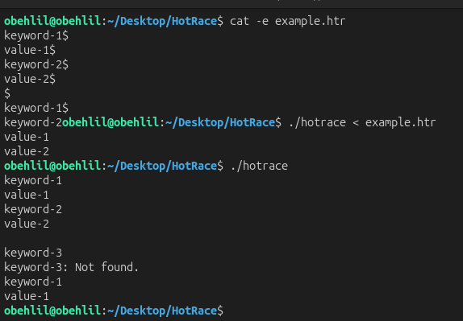

# HotRace

A fast, lightweight key-value store implemented in C using a hash map with open addressing and chaining for collision resolution. Built for learning purpose.

---

## Overview

HotRace reads key-value pairs from standard input, stores them in an efficient hash map, then answers lookup queries — all in a single pass. It is designed to handle large datasets quickly with minimal memory overhead.

---

## How It Works

The program runs in two phases:

1. **Store phase** — reads alternating key/value lines and inserts them into the hash map.
2. **Fetch phase** — reads query keys and prints the associated value, or `<key>: Not found.` if absent.

---

## Usage

```bash
make
./hotrace < input.txt
```

### Input Format

```
key1
value1
key2
value2

key1
key3
```

- Key-value pairs are separated by a blank line from the query section.
- Each key and value is on its own line (max 255 characters).

### Example




---

### Hash Function

Uses **FNV-1a 32-bit**, a fast non-cryptographic hash known for good distribution:

```c
h = 2166136261u;
h ^= byte; h *= 16777619u;  // per character
```

### Collision Handling

Collisions are resolved with **separate chaining** — each bucket holds a linked list of entries that share the same index.

---

## Compilation

```bash
make        # build
make clean  # remove objects
make fclean # remove objects + binary
make re     # rebuild from scratch
```

> Requires a C compiler (cc/gcc/clang) and GNU Make.

---

## Constraints

- Keys and values are capped at **255 characters**.
- The map holds up to **1,000,003** entries (prime capacity to reduce clustering).
- No external libraries — only `read`, `write`, `malloc`, and `free`.

---

## Author

**obehlil** — 42 School Project